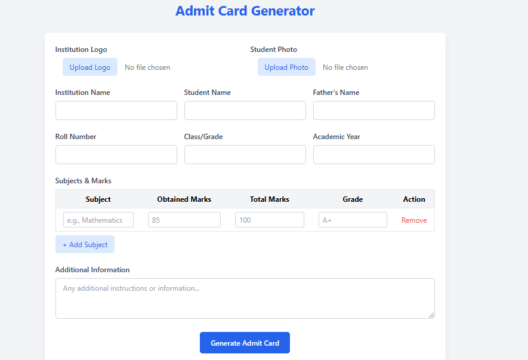

# Admit Card Generator

A web application for schools and institutions to generate professional admit cards with student information, subjects, marks, and automatic PDF generation.

## Features

- 📝 Fillable form for student information
- 🖼️ Upload institution logo and student photo
- 📚 Add unlimited subjects with marks and grades
- 📊 Automatic calculation of totals and percentage
- 📄 Multi-page PDF generation
- 🖨️ Professional print-ready output
- 📱 Responsive design

## Technologies Used

- HTML5
- Tailwind CSS
- JavaScript
- jsPDF (for PDF generation)
- html2canvas (for converting HTML to PDF)

## How to Use

1. Fill in the student details
2. Upload institution logo and student photo (optional)
3. Add all subjects with obtained marks and total marks
4. Click "Generate Admit Card" button
5. PDF will automatically download

## Customization

You can easily customize:
- Color scheme by modifying Tailwind classes
- Layout by editing the HTML structure
- Fields by adding/removing form elements
- PDF styling by changing the template CSS

## Requirements

- Modern web browser (Chrome, Firefox, Edge)
- No server required - works completely client-side

## License

This project is licensed under the MIT License - see the [LICENSE](LICENSE) file for details.

## Author

👤 **Muhammad Hasnain**

## Contact Information

For any inquiries or support, please contact:

**Name:** Muhammad Hasnain  
**Phone:** [+92 322 174013](tel:+92322174013)  
**Email:** [m.hasnainreactions@gmail.com](mailto:m.hasnainreactions@gmail.com)  

## Contributing

Contributions are welcome! Please open an issue or submit a pull request.

---

**Note:** This is a client-side application. All processing happens in the browser - no data is sent to any server.